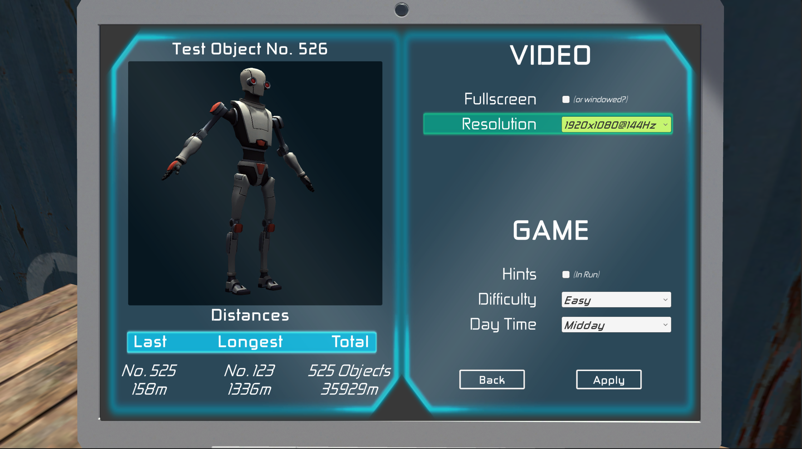

<h1><a href="https://koonraddev.itch.io/run-kyle-run">Run! Kyle Run!</a></h1>

<table class="tg">
<thead>

<tbody>
  <tr>
    <td></td>
    <td></td>
  </tr>
  <tr>
    <td></td>
    <td></td>
  </tr>
</tbody>
</table>

<h2>PLOT</h2>

it's you Robot Kyle. Everybody knows you, but You dont know why. You "wake up" in between some cargo containers but You dont know why. This is some industry or something but You are not sure. Yes, You know nothing Robot Kyle or mabye not? I mean, One thing is for sure. They want to CATCH You! But who are They? Okey, That's enough, no more questions. Just run for your life. What are you waiting for?

<h2>CONTROLS</h2>
<ul>
    <li>LEFT ARROW - Move left</li>
    <li>RIGHT ARROW - Move right</li>
    <li>UP ARROW - Jump</li>
    <li>DOWN ARROW - Force Down</li>
    <li>SHIFT - Run</li>
</ul>

<h2>ABOUT PROJECT</h2>

The first project created in 3D. I used a system that generates the world on an ongoing basis along with the player's progress, using previously prepared prefabs. I became familiar with the basics of ProBuilder toolkit, the DOTween library and the TextMeshPro extension.

